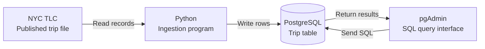
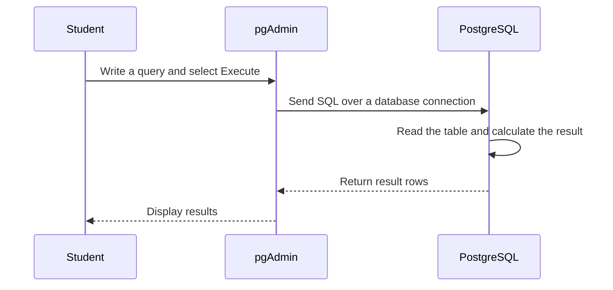
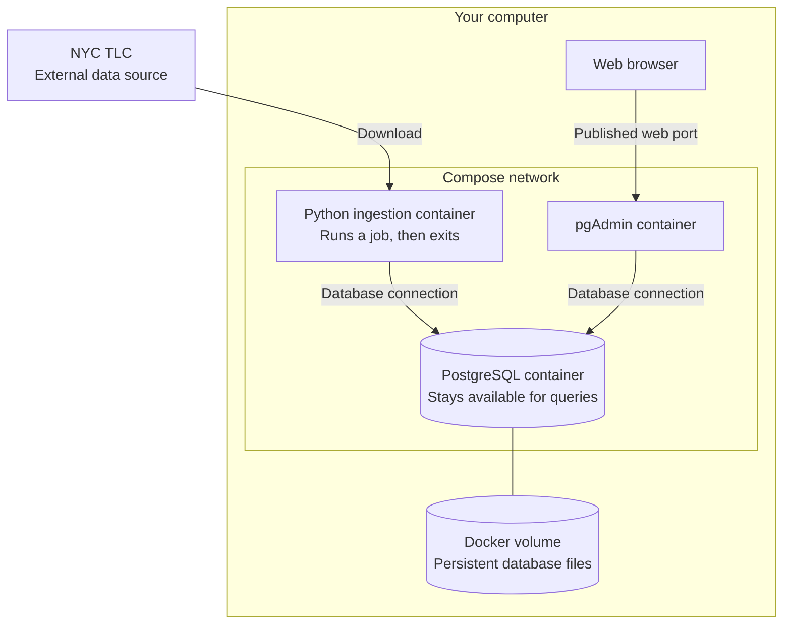

# Week 2 — PostgreSQL & Data Ingestion

[Module homepage](../../README.md)

## Learning objectives

This week, we will turn a published data file into a table that we can inspect and query. By the end of the exercise, you should be able to:

- explain the roles of Python, PostgreSQL, pgAdmin, and Docker;
- trace how data moves from a source file into a database;
- distinguish a database server from a client that connects to it;
- explain what a table, row, column, and schema represent;
- use SQL to inspect loaded data and check whether ingestion worked.

## Before the session

Read this introduction before the practical exercise. You do not need previous experience with PostgreSQL or pgAdmin. Basic familiarity with Python variables and functions will help.

Think back to the data-engineering lifecycle: sources, ingestion, storage, transformation, and serving. We will implement a small part of that lifecycle on our own computers.

## Key concepts

### What do we want to do?

Imagine an analyst investigating taxi activity in New York City. They want to answer questions such as:

- How many recorded trips started on each day?
- How does average trip distance vary by pickup location?
- Are there missing values or unexpected fares that could affect the analysis?

The NYC Taxi & Limousine Commission (TLC) publishes trip records as downloadable files. Those files are our **source**. The official page also provides data dictionaries explaining the fields. Monthly trip files are published in **Parquet**, a format that stores data by column and carries information about column types. See the [TLC trip-record page](https://www.nyc.gov/site/tlc/about/tlc-trip-record-data.page).

Our goal is to build this path:



Python will acquire and load the records. PostgreSQL will store them and execute queries. We will use pgAdmin to send those queries and view the results.

Files can also be analysed directly. We use a database here to practise explicit table structures, repeatable SQL queries, and access through different programs.

### What is PostgreSQL?

**PostgreSQL**, often shortened to **Postgres**, is an open-source relational database management system. It runs as a server: other programs connect to it to store, retrieve, and change data. A database server can run on your own laptop; “server” describes its role, not necessarily a separate physical machine. See the [PostgreSQL tutorial](https://www.postgresql.org/docs/current/tutorial-start.html).

In a relational database, data is organised into **tables**:

- A **row** represents one record. In our trip table, the intended grain—the meaning of one row—is one source trip record.
- A **column** represents an attribute, such as pickup time or trip distance.
- A **data type** specifies what kind of value a column accepts, such as a timestamp, integer, or decimal number.
- A **table schema** describes its columns, types, and constraints. PostgreSQL also uses “schema” for a named namespace that groups tables and other database objects.

For illustration, a simplified table could look like this. These rows are fictional, and the column names are explanatory rather than a promised implementation schema.

| pickup_time | pickup_zone_id | trip_distance_miles | total_amount_usd |
|---|---:|---:|---:|
| 2026-01-05 08:10 | 161 | 2.4 | 19.50 |
| 2026-01-05 08:25 | 237 | 1.1 | 12.00 |
| 2026-01-06 09:00 | 161 | 3.2 | 24.80 |

Tables can be related through shared identifiers. Later, a taxi-zone lookup table can connect a zone ID to a readable location name.

### What is SQL?

**SQL** is a language for working with relational data. You describe the result you want, and PostgreSQL executes the query.

For example, if our loaded table were named `taxi_trips`, this query would count its rows:

```sql
SELECT COUNT(*) AS trip_count
FROM taxi_trips;
```

`FROM` identifies the table, `COUNT(*)` counts rows, and `AS` names the result column. This is an illustrative query for after a table has been created and loaded.

A count tells us how many rows are present. We still need to compare it with the input and inspect the values before concluding that ingestion succeeded.

### What is pgAdmin?

**pgAdmin** is a graphical tool for working with PostgreSQL. In our planned setup, you will open its interface in a web browser. You can browse tables, inspect columns, and write SQL in its query editor. See the [official pgAdmin overview](https://www.pgadmin.org/).

pgAdmin acts as a **client**: it sends requests to PostgreSQL and displays the responses. PostgreSQL stores the trip data and performs the query work. Closing the browser does not delete the database.



### Why do we use Python?

**Ingestion** means bringing data from a source into a system where we can use it. Our Python program will make this process repeatable:

1. Obtain the selected source file.
2. Read its records and check the expected fields.
3. Prepare values for the destination table.
4. Connect to PostgreSQL and write rows.
5. Report what was loaded or why the run failed.

Python is another database client. It connects directly to PostgreSQL; it does not need pgAdmin to load data. Automating these steps lets us repeat the process when another file becomes available.

### Why do we use Docker and Docker Compose?

Our exercise needs several programs and their dependencies. **Docker** lets us run them in isolated environments called **containers**, using a shared configuration to reduce differences between student setups.

An **image** is a packaged template containing an application and its dependencies. A **container** is an instance created from that image. We will use separate containers for PostgreSQL, pgAdmin, and the Python ingestion program. See [Docker’s overview](https://docs.docker.com/get-started/docker-overview/).

**Docker Compose** describes these services together in one configuration file, including how they connect and where they store persistent data. See [how Compose works](https://docs.docker.com/compose/intro/compose-application-model/).

The planned local arrangement is:



Three terms will matter during setup:

| Term | Meaning in this exercise |
|---|---|
| Network | Allows containers to communicate. Within the Compose network, clients can address PostgreSQL by its service name. |
| Port | Identifies a service endpoint. Publishing pgAdmin’s web port makes its interface reachable from your browser. |
| Volume | Keeps database files outside the container’s writable layer, so replacing the container can preserve its data. Explicitly deleting the volume deletes those files. |

One connection detail to remember: inside a container, `localhost` refers to that container. The pgAdmin container therefore needs PostgreSQL’s service name to connect to the database container.

### How do the concepts map to the tools?

| Concept | Implementation in this exercise | Responsibility |
|---|---|---|
| Source | NYC TLC trip file | Provides published trip records and field definitions. |
| Ingestion | Python program | Acquires records and loads the destination. |
| Storage and query execution | PostgreSQL | Stores tables and executes SQL. |
| Human access | pgAdmin | Lets us inspect tables and submit queries. |
| Execution environment | Docker | Runs each application with its dependencies. |
| Local service configuration | Docker Compose | Describes services, connections, and volumes together. |

## In-class activities

Start with the [From Source to Query activity](part-1-source-to-query.md). Use the roles introduced here to explain responsibilities and possible failures in your own words.

Discuss with a partner:

1. Which components need to run while Python loads the data?
2. Which components need to run when you inspect an already loaded table?
3. If no rows appear in pgAdmin, what would you investigate before deciding the source file is empty?

## Practical exercise

The practical goal is to load a selected monthly trip file into a local PostgreSQL table and inspect it through pgAdmin. We will work through these checkpoints:

| Checkpoint | Evidence to collect |
|---|---|
| Understand the source | Explain what one record represents and identify relevant fields in the data dictionary. |
| Reach the database | Establish a connection from pgAdmin to PostgreSQL. |
| Run ingestion | Observe Python’s progress and completion or error report. |
| Inspect the result | Find the table, inspect its column types, and query a few rows. |
| Verify the load | Compare input and loaded row counts; investigate missing or unexpected values. |

Start with [Part 2: PostgreSQL and pgAdmin](part-2-postgres-and-pgadmin.md) to run the database environment and verify your connection. The Python ingestion steps will follow in a later part.

## Connection to the semester project

This local pipeline introduces the source-to-storage path needed for your project. The same questions will matter when you later move to cloud storage and scheduled execution: where does the data originate, what does one record mean, who moves it, and how do you know the result is usable?

For your own project, identify a candidate source, a possible destination, and one check that would help you detect an unsuccessful ingestion run.

## After the session

Draw the pipeline from memory. Label the data source, both database clients, the database server, and the persistent storage. Explain one failure that could prevent an analyst from seeing trustworthy results.

Keep your diagram and verification observations for the next practical session.

## Resources

**Required for the exercise:**

- [From Source to Query](part-1-source-to-query.md) — the accompanying DENG activity.
- [NYC TLC trip records and data dictionaries](https://www.nyc.gov/site/tlc/about/tlc-trip-record-data.page) — inspect the dictionary for the selected trip dataset.

**Optional reference:**

- [PostgreSQL tutorial](https://www.postgresql.org/docs/current/tutorial-start.html)
- [pgAdmin overview](https://www.pgadmin.org/)
- [Docker overview](https://docs.docker.com/get-started/docker-overview/)
- [Docker Compose application model](https://docs.docker.com/compose/intro/compose-application-model/)
- [Zoomcamp Docker and SQL material](https://github.com/DataTalksClub/data-engineering-zoomcamp/tree/main/01-docker-terraform/docker-sql) — supporting practical reference. This DENG introduction and its diagrams were written independently; no Zoomcamp code is reproduced here.
