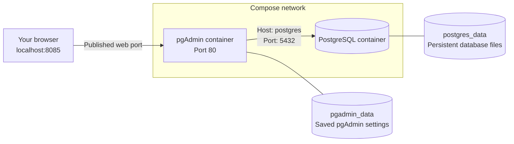

# Week 2 — Part 2: Start PostgreSQL and connect with pgAdmin

[Week overview](README.md) · [Previous: From Source to Query](part-1-source-to-query.md) · [Example files](../../examples/nyc-taxi/README.md)

## Goal

By the end of this part, you can connect to PostgreSQL, execute SQL, and explain where the database runs and stores its data. We will establish a working destination before writing the Python ingestion program.

Allow approximately 20–30 minutes, plus the initial image download. Work with your partner and keep a short record of your verification results.

## 1. Prepare your environment

Start Docker Desktop, or your installed Docker engine. In a terminal, check:

```sh
docker version
docker compose version
```

The first command should report both a client and a server. The second should report Compose v2. If Docker is not installed, follow the [official installation instructions](https://docs.docker.com/get-started/get-docker/) for your operating system.

From the repository root, move into the example directory:

```sh
cd examples/nyc-taxi
```

All remaining terminal commands assume this working directory.

Copy `.env.example` to `.env` once. On macOS/Linux:

```sh
cp .env.example .env
```

In Windows PowerShell:

```powershell
Copy-Item .env.example .env
```

Open `.env` in your editor and replace both example passwords with different local lab passwords. For a straightforward first setup, use letters and digits; Compose interprets some characters, including `$`, specially. Keep the database name `ny_taxi` and username `deng` for the examples below. Do not overwrite an existing `.env` when returning to the lab.

There are **two accounts**: a pgAdmin account for signing into the web interface and a PostgreSQL account for connecting to the database. Their passwords serve different purposes. Keep `.env` out of Git and screenshots.

## 2. Read the configuration before starting it

Open [compose.yaml](../../examples/nyc-taxi/compose.yaml). Identify the two services, their images, and their volumes.



- `image` identifies the packaged software version to run.
- `environment` supplies settings from your `.env` file.
- `volumes` attach persistent storage to the containers.
- `ports` publishes pgAdmin's web interface on your own computer.
- `healthcheck` asks PostgreSQL whether it is accepting connections. It does not prove that a particular password works or that data has been loaded.
- `depends_on` with `service_healthy` delays pgAdmin startup until PostgreSQL passes that readiness check.

### Two connections, two addresses

You will use your usual web browser on your laptop—for example Firefox, Chrome, Edge, or Safari—to open pgAdmin. The browser displays the interface; the pgAdmin application runs in its Docker container.

There are two separate connections:

| Connection | Address used | What happens |
|---|---|---|
| Your laptop's browser → pgAdmin | `http://localhost:8085` | The browser contacts port `8085` on your laptop. Docker forwards that connection to port `80` in the pgAdmin container. |
| pgAdmin container → PostgreSQL container | Host `postgres`, port `5432` | pgAdmin connects across the Compose network to the database service named `postgres`. |

**`localhost` means “this network environment.”** For the browser running on your laptop, it refers to the laptop itself. Inside the pgAdmin container, it refers to that container's own network environment. The same name therefore refers to different places depending on where the connecting program runs.

The `ports` entry in our configuration makes the first connection possible. With the default settings, `127.0.0.1:8085:80` publishes the container's web port `80` on the laptop's local loopback address, port `8085`. You will open that address in step 4, after starting the services.

For the second connection, Compose provides a shared network where service names act as hostnames. `postgres` is the name we gave the database service in `compose.yaml`; it is how pgAdmin locates that container. We do not need to publish PostgreSQL's port on the laptop for this connection.

**Discuss:** If you entered `localhost` as the database host in pgAdmin, where would pgAdmin try to connect? Use the diagram to explain your answer.

## 3. Start the services

```sh
docker compose config --quiet
docker compose up -d --wait
docker compose ps
```

The validation command prints nothing on success. The first startup downloads the images and initialises storage. `-d` leaves the services running in the background. `--wait` waits for running or healthy services; PostgreSQL should appear healthy and pgAdmin running. pgAdmin's web interface may take a little longer to become available.

To inspect startup messages:

```sh
docker compose logs --tail=30 postgres pgadmin
```

Do not share unreviewed logs or configuration output containing credentials.

## 4. Connect through pgAdmin

1. Open [http://localhost:8085](http://localhost:8085) in your browser. If you changed `PGADMIN_PORT`, use that port instead.
2. Sign in with the pgAdmin email and password from `.env`.
3. In the object browser, right-click **Servers**, then choose **Register → Server**.
4. On **General**, enter a display name such as `DENG local`.
5. On **Connection**, enter:

| Field | Value with the supplied defaults |
|---|---|
| Host name/address | `postgres` |
| Port | `5432` |
| Maintenance database | `ny_taxi` |
| Username | `deng` |
| Password | Your `POSTGRES_PASSWORD` |

6. Save the connection and expand **Databases → ny_taxi**. If prompted for the database password again, use `POSTGRES_PASSWORD`.

Registering a server saves a connection definition in pgAdmin. PostgreSQL and the `ny_taxi` database were already created during startup.

## 5. Execute your first SQL queries

Select `ny_taxi` and open **Tools → Query Tool**. Execute each statement separately using the Execute button:

```sql
SELECT version();
```

The result should identify PostgreSQL 18.6; the remaining platform/build text may vary.

```sql
SELECT current_database();
```

The result should be `ny_taxi`, unless you deliberately selected another database name.

These queries verify that pgAdmin can submit SQL and receive results. No taxi table exists yet.

## 6. Observe persistence

Create one small learning table in the Query Tool. This is a separate scratch table for this activity:

```sql
CREATE TABLE IF NOT EXISTS connection_check (
    id INTEGER PRIMARY KEY,
    note TEXT NOT NULL
);

INSERT INTO connection_check (id, note)
VALUES (1, 'My database connection works')
ON CONFLICT (id) DO NOTHING;

SELECT * FROM connection_check;
```

Ensure **Auto commit** is enabled in the Query Tool, or commit the transaction before continuing. The result should contain one row.

In the terminal, remove the containers and start them again:

```sh
docker compose down
docker compose up -d --wait
```

Reconnect in pgAdmin, reopen the Query Tool if needed, and run:

```sql
SELECT * FROM connection_check;
```

The row should still exist. The named volume preserved the database files when the container was removed. pgAdmin's separate volume preserves its saved connection settings. Neither volume is a backup.

## 7. Finish and record your checkpoint

Record the two verification query results and the persistence result. Explain to your partner:

- which component executed the SQL;
- why the database hostname was `postgres`;
- what the PostgreSQL volume contains;
- why restarting pgAdmin does not reload or delete trip data.

When finished, stop the environment while keeping its data:

```sh
docker compose down
```

The next part will introduce the source file and the Python program that loads it.

## Troubleshooting

| Symptom | What to check |
|---|---|
| Cannot connect to the Docker daemon | Start Docker Desktop/the engine and wait until `docker version` reports a server. |
| Compose reports a missing variable | Ensure `.env` exists in `examples/nyc-taxi`, contains all five required account/database settings, and is not named `.env.txt`. |
| `--wait` is not recognised | Update Docker Compose/Desktop to a current v2 release. |
| Download fails | Check your internet connection and Docker registry access; retry startup after resolving the download error. |
| Port 8085 is already allocated | Change `PGADMIN_PORT` to `8086`, rerun `docker compose up -d --wait`, and open that port in the browser. |
| pgAdmin page is unavailable | Check `docker compose ps` and pgAdmin logs. Wait briefly after first startup, then refresh. |
| Database connection refused | Use host `postgres` and port `5432`; verify PostgreSQL is healthy. `localhost` inside pgAdmin refers to the pgAdmin container. |
| Password authentication failed | Use the PostgreSQL password for the server connection, not the pgAdmin login password. Check whether the volume was initialised with an earlier password. |
| Editing `.env` did not change an account | Initialisation settings create accounts on first startup with empty storage. Editing `.env` does not change passwords already stored in PostgreSQL or pgAdmin. Use the existing credentials and the application's account-management tools. |

### Optional: completely reset this disposable lab

**This deletes both named volumes: all database tables and saved pgAdmin settings in this Compose project.** Use it only if you deliberately want a fresh lab and have no data to keep. Check that your terminal is in this example directory.

```sh
docker compose down --volumes
docker compose up -d --wait
```

The next startup initialises both applications from your current `.env`; register the server in pgAdmin again.

## References

- [PostgreSQL container configuration and initialisation](https://hub.docker.com/_/postgres)
- [pgAdmin container deployment](https://www.pgadmin.org/docs/pgadmin4/latest/container_deployment.html)
- [Compose startup readiness](https://docs.docker.com/compose/how-tos/startup-order/)

The DENG configuration, instructions, and diagram were written independently.
