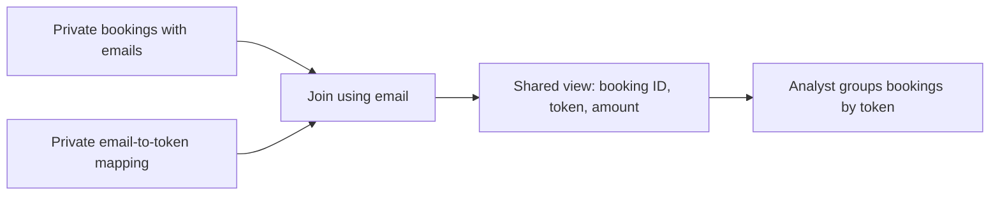

# Week 3 — Part 2: Tokenization and access

[Week 3 overview](README.md) · [Previous: transformation](part-1-transformation.md)

## Goal

Let an analyst count bookings per customer without seeing customer emails. We use two fictional customers and three bookings, supplied directly in the SQL file. These are separate from the taxi data, which has no passenger-email field.

A **token** is a substitute identifier. We generate a random UUID for each customer and retain the email-to-token mapping in a restricted table. The same customer keeps the same token across bookings and reruns.



The analyst can use the shared view but cannot read the private mapping. This exercise demonstrates database tokenization and permissions, not a production token vault. Tokens still link a person's records; they do not automatically make the data anonymous.

## Step 1 — Read the setup before running it

Open [05-tokenization.sql](../../examples/nyc-taxi/sql/week3/05-tokenization.sql). It creates:

| Object | Purpose |
|---|---|
| `week3_private.customers` | Stores fictional emails and their random tokens. |
| `week3_private.bookings` | Stores three fictional bookings with their source emails. |
| `week3_shared.bookings` | A view exposing tokens and amounts, without emails. |
| `deng_week3_analyst` | A role with permission to read the shared view. |

`gen_random_uuid()` creates a random identifier; it does not encrypt the email or calculate a hash from it. `DEFAULT` generates this value when we insert a customer without specifying a token. The primary key on email ensures one mapping per customer.

`ON CONFLICT ... DO NOTHING` keeps existing rows when the script runs again, so the tokens stay stable. The short `DO` block creates the role only if it does not already exist.

**Predict:** How many different tokens should the analyst see for three bookings belonging to two customers?

## Step 2 — Create the fictional data and permissions

Use pgAdmin's Query Tool connected to `ny_taxi` with your Week 2 administrator account. Run the entire setup file. Its `BEGIN` and `COMMIT` keep the setup in one transaction.

`GRANT` gives a permission; `REVOKE` removes a permission. `PUBLIC` here means all database roles, not the schema named `public`. The analyst receives schema `USAGE` (permission to access objects in that namespace) and `SELECT` on the shared view. The analyst gets no access to the private schema.

The view is owned by the administrator. PostgreSQL's default view permissions allow its owner to read the underlying tables while granting the analyst only access to the view's selected fields.

**Finish with:** two customers, three bookings, and a shared view. Rerunning this setup keeps the same fixture records and tokens.

## Step 3 — Query with analyst permissions

Open [06-check-access.sql](../../examples/nyc-taxi/sql/week3/06-check-access.sql). **Run its numbered blocks one at a time**, not the whole file.

In the Query Tool toolbar, enable **Auto commit**: hover over the controls to find its name. Each standalone statement should finish its transaction automatically. This matters because one statement below is deliberately denied.

First, inspect the mapping as the administrator. Then execute:

```sql
SET ROLE deng_week3_analyst;
SELECT current_user;
```

The result should show `deng_week3_analyst`. `SET ROLE` changes the permissions used by this connection. This role has `NOLOGIN`, so we demonstrate its permissions through our administrator connection rather than creating another login and password.

Run the grouped query in block 3. Expect two result rows: one token with **2 bookings and 30.00 USD**, another with **1 booking and 25.00 USD**. Your random token values will differ from your partner's.

Now execute block 4, which tries to read `week3_private.customers`. Expect **permission denied for schema week3_private**. This is the intended result.

Finally, execute block 5 separately:

```sql
RESET ROLE;
SELECT current_user;
```

This restores your administrator identity. If you accidentally used an open transaction and see “current transaction is aborted,” run `ROLLBACK;` first, then `RESET ROLE;`.

**Finish with:** a successful query using tokens and a denied query for the mapping. If the mapping query succeeds, check `current_user`; you may still be using administrator permissions.

## Step 4 — Explain the boundary

Discuss with a partner:

- Why can the administrator recover an email while the analyst cannot?
- Why must the token stay the same across a customer's bookings?
- Would displaying `a***@example.com` provide the same mapping mechanism? That is masking: hiding parts of the displayed value.
- How does encryption differ? Encryption produces ciphertext that an authorized system can decrypt with a key; this exercise uses a stored mapping instead.
- Where should an ingestion pipeline replace sensitive identifiers before exposing data to analysts?

Our source emails stay in restricted tables, and substitution happens in a view at query time. A pipeline that must avoid storing emails in its analytical database would tokenize **before loading into that destination**, keeping the mapping in a separately protected system.

An administrator can use `RESET ROLE` to regain access; this demonstration does not take away administrator powers. A real analyst would use a separate restricted login. Hiding an email column alone is also insufficient if the analyst can still query the original table.

Return to the [project discussion](README.md#3-apply-the-decisions-to-your-project).
